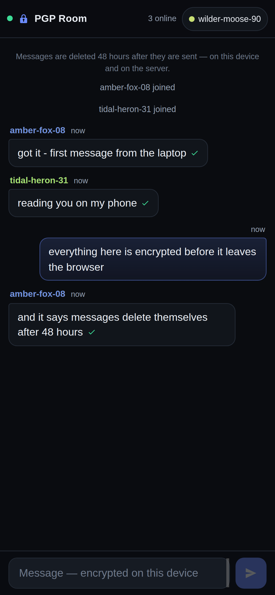
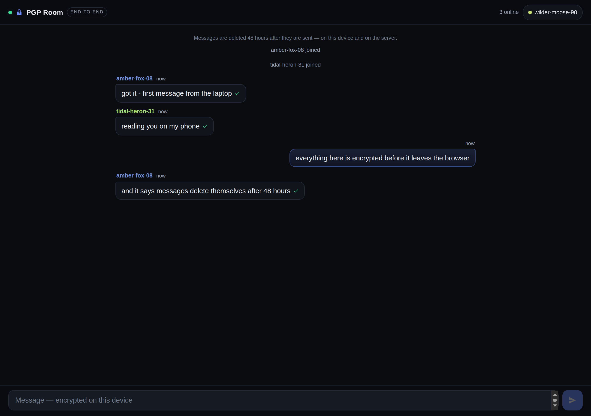

# PGP Room

**End-to-end encrypted group chat in the browser. The server stores ciphertext it cannot read — not even root can.**

One public room, one link. Every visitor's browser generates their own OpenPGP keypair and a random
handle; every message is encrypted **in the browser** to every public key in the room's key pool *at the
moment it is sent*, and signed by the sender. A key that registered later cannot read earlier
ciphertext, because it was never a recipient of it. Messages self-destruct after the retention window
(48 hours by default) on the server **and** in every open client.

Built for small groups who want a shared room without trusting whoever runs the box.

```
┌──────────────────┐          ┌───────────────────────────┐          ┌──────────────────┐
│  Browser A       │          │  Relay (storage only)     │          │  Browser B       │
│  keypair A       │          │  no keys, no crypto lib   │          │  keypair B       │
│                  │  HTTPS   │                           │   WSS    │                  │
│  encrypt(msg,    │ ───────► │  {id, t, fp, recipients,   │ ───────► │  decrypt(key B)  │
│   [pubA, pubB])  │   WSS    │   ct: "-----BEGIN PGP…"   │          │  verify(sig A)   │
└──────────────────┘          │  }                        │          └──────────────────┘
                              │  data/messages/<day>.jsonl│
                              └───────────────────────────┘
```

## What it looks like

<p>
  
  
</p>

## Features

- **Real end-to-end encryption.** OpenPGP (Curve25519 ECDH + Ed25519) generated and used in the
  browser via [openpgp.js](https://openpgpjs.org/). Private keys never leave `localStorage`.
- **Key-pool access model.** A message is readable by exactly the keys that existed when it was sent,
  so new joiners get the new conversation, not the archive.
- **Signed messages.** Every message carries the sender's signature, verified in the recipient's
  browser (a check mark appears on verified bubbles).
- **No accounts, no email, no database.** Random handle + keypair on first visit. The relay keeps
  ciphertext in append-only per-day files.
- **Retention built in.** 48-hour default window; expired ciphertext is overwritten and unlinked on
  the server and pruned from open tabs.
- **Tiny surface.** The server is one Node file with a single runtime dependency (`ws`). The client is
  vanilla ES2020 + one vendored crypto bundle. No framework, no build step, no CDN, no third-party
  origins (strict CSP).
- **Mobile-first UI.** Dark, slim header, 44px touch targets, safe-area aware, animated but restrained.

## Quick start

```bash
git clone https://github.com/jlaiii/pgp-chat-room.git
cd pgp-chat-room
npm install
cp config.example.json config.json
npm start                       # -> http://127.0.0.1:8788
```

Browsers only expose WebCrypto (which openpgp.js needs) in a **secure context**: `http://localhost`
and `http://127.0.0.1` are exempt, any real deployment must be HTTPS. See
[docs/DEPLOYMENT.md](docs/DEPLOYMENT.md) for the systemd + Caddy/nginx recipe.

## How it works

1. First visit: the browser generates an OpenPGP keypair, picks a random handle (`quiet-otter-42`),
   stores the identity in `localStorage`, and registers the **public** key with the relay.
2. The relay keeps the *key pool* (fingerprints + public keys). It broadcasts additions so every open
   tab can encrypt to the newest member.
3. Sending: the client fetches the pool, encrypts once with multiple recipients
   (`encryptionKeys: [...pool]`), signs with its own private key, and posts the ASCII-armored
   ciphertext over the WebSocket.
4. The relay stores `{id, seq, t, fp, handle, recipients[], ct}` and fans the frame out. It never
   sees plaintext and has no OpenPGP library installed.
5. History: `GET /api/history?fp=<yours>` returns only the messages whose `recipients` include your
   fingerprint, plus a `lockedCount` for the rest — that is what the "N earlier messages can't be
   read" divider is.

More detail: [docs/ARCHITECTURE.md](docs/ARCHITECTURE.md) · wire format:
[docs/PROTOCOL.md](docs/PROTOCOL.md)

## Security model

| Guarantee | How |
|---|---|
| The host cannot read messages | Private keys only ever exist in browsers; the server has no crypto library and no keys (`npm ls openpgp` on the server is empty) |
| Stolen disk / backups leak nothing readable | Only ASCII-armored ciphertext is ever written to disk |
| History is not retroactively exposed | Messages are sealed to the pool at send time; a later key is not a recipient |
| Tampering is detectable | Every message is signed; recipients verify against the sender's registered public key |
| No third-party data paths | Single origin, strict CSP, no CDN, no analytics, no external fonts |
| Messages don't linger | 48h retention: overwritten + unlinked server-side, pruned in open tabs |

**Honest limits** (read [docs/SECURITY.md](docs/SECURITY.md) before trusting it with anything):

- It is a **public room**: anyone with the link can join and read everything from that point on.
- **Per-device identity.** A phone and a laptop are two different identities with separate histories;
  the key backup (`.asc`) is the only way to move devices, and losing it loses that history forever.
- The operator can **censor the relay** (drop, reorder, or refuse to store frames) but cannot decrypt.
- Overwrite-before-unlink is best effort on a journalled/CoW filesystem; the durable guarantee is that
  what is deleted is ciphertext nobody can open.

## Configuration

`config.json` (start from `config.example.json`; `PGPCHAT_CONFIG=/path/to.json` overrides the location):

| Key | Default | Meaning |
|---|---|---|
| `port` / `bind` | `8788` / `127.0.0.1` | listen address (keep it on loopback behind a TLS proxy) |
| `publicUrl` | `""` | public room URL; used for the CSP WebSocket origin |
| `retentionHours` | `48` | message lifetime, enforced server-side and published to clients |
| `cleanupMinutes` | `1` | how often the retention sweep runs |
| `trustProxy` | `true` | read `X-Forwarded-For` (only behind your own proxy) |
| `maxPool` | `500` | key pool cap; oldest idle keys are evicted above it |
| `maxMsgBytes` | `131072` | ciphertext size cap (a message encrypted to ~300 keys is ~90KB) |
| `historyLimit` | `400` | messages returned per history fetch |
| `rate` | 25 msgs / 8 keys / 40 conns per IP per minute | abuse bounds |

## Retention

Messages live `retentionHours` and then are gone — from memory, from disk, and from open tabs:

- Per-day segment files `data/messages/<UTC-day>.jsonl`. Each sweep overwrites whole expired segments
  with random bytes (2 passes + `fsync`) and unlinks them; the boundary segment is rewritten without
  the expired rows and the old file is shredded first.
- The client prunes expired bubbles on a 60s timer and takes the window **from the server**, so the
  two never disagree.
- `/api/pool`, `/api/history` and `/healthz` all publish `retentionHours`.

## Testing

```bash
npm test
```

`test/integration.mjs` boots a real server on a temp data directory and asserts the things that
matter: a later-joining key **cannot** read earlier ciphertext, messages sent after it joins decrypt
and verify, a non-recipient key fails to decrypt, nothing plaintext lands on disk, the rate limiter
engages, and the retention restart wipes expired rows. CI runs it on every push
(`.github/workflows/test.yml`).

There is also a browser-side harness for live delivery — see
[docs/TESTING.md](docs/TESTING.md) — used to prove that a message reaches an open tab in well under a
second (headless tabs freeze, which makes naive multi-browser checks lie).

## Repo layout

```
server.js               relay: HTTP + WebSocket, ciphertext storage, presence, retention sweep
public/index.html       single page app shell
public/app.js           all client logic: keygen, encrypt/decrypt/sign, UI, retention pruning
public/style.css        dark mobile-first theme
public/vendor/          vendored openpgp.min.js (refresh with: npm run vendor)
scripts/telegram-notify.py   optional join/leave notifications (Telegram Bot API)
scripts/vendor.mjs      copies openpgp from node_modules into public/vendor
deploy/                 systemd unit + Caddy/nginx examples
test/integration.mjs    end-to-end test suite
docs/                   architecture, protocol, security, deployment, testing, contributing
```

## License

MIT. Vendored [openpgp.js](https://github.com/openpgpjs/openpgpjs) is LGPL-3.0.
