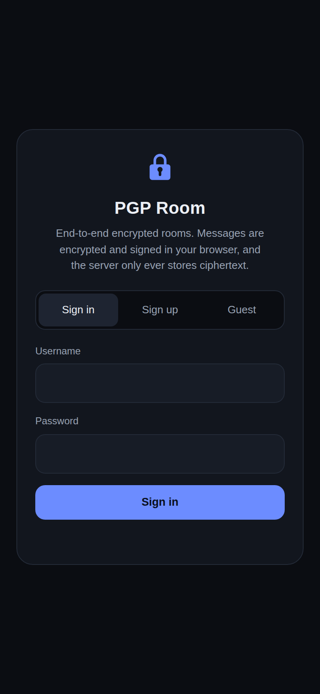
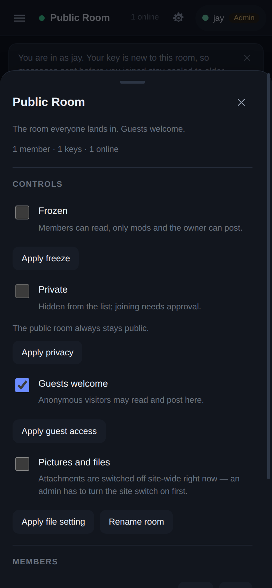
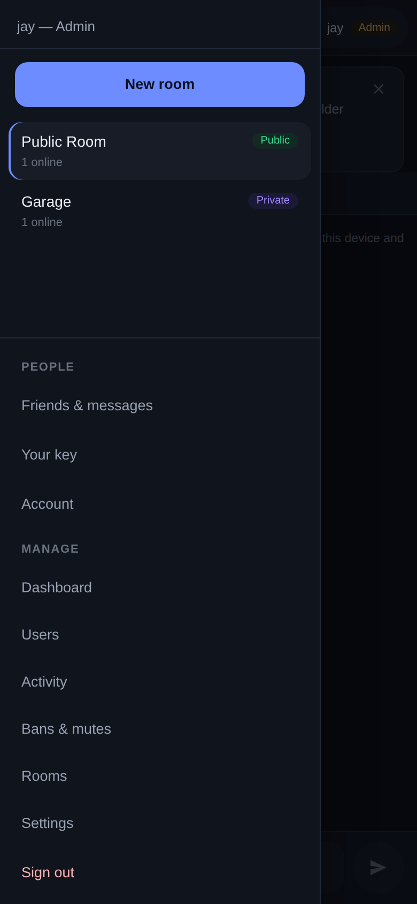

# PGP Room

Self-hosted, end-to-end encrypted group chat with real rooms, accounts and moderation.
Every message is encrypted **and signed in the browser** before it is sent, so the server
stores ciphertext it cannot read — and holds no key that could ever open it.

The room where this started was a single public chat. It is now a multi-room relay with a
public lounge, private rooms, guests, three staff levels and an admin panel — while keeping
the original promise: the relay has no OpenPGP library, no private keys and no decryption
code path.

```
browser A ──encrypt+sign──▶ relay (ciphertext only) ──▶ browser B, C, D
     ▲                                                     │
     └────────────── keys never leave the browser ──────────┘
```

<p align="center">
  
  
  
</p>

## What it does

- **Rooms.** A public lounge that everyone lands in, plus any number of rooms users create.
  Each room has **two independent locks**: *freeze* (readable, but only mods and the owner
  may post) and *private* (hidden from the list, entry needs approval).
- **Identity, three ways.** Sign in with username + password, create an account, or continue
  as a **guest** — a random handle with no account, limited to rooms that welcome guests.
- **Roles.** `admin` › `mod` › `user` › `guest`. Admins run the site and can enter any room;
  mods handle people and rooms; the owner of a room controls that room.
- **Pictures, video and files — off until an admin says otherwise.** Attachments are gated twice:
  a site-wide switch per kind (pictures / video / other files) and the room's own switch. Both are
  off out of the box, so a fresh relay takes text only. A file is sealed in the browser with a
  one-off AES-GCM key, and **that key travels inside the room's OpenPGP message** — the relay stores
  a blob it cannot open, and never learns the filename.
- **The message lifetime is a setting, not a rebuild.** An admin picks 1 hour … 30 days, or *keep
  until cleared by hand*. Shortening the window sweeps the relay the moment it is applied, and
  attachments follow the same window as the messages that point at them.
- **Your own messages are yours — until the admin says otherwise.** Delete your own message and
  its ciphertext is shredded on the relay that instant; what stays in the timeline is a tombstone
  that says something was there. Edit your own message and the new ciphertext replaces the old one
  (the superseded one is shredded too). Two switches in *Settings → Messages* decide whether people
  may delete and edit at all. Staff can always delete for moderation — nobody can ever rewrite
  another account's words, because the relay cannot re-sign a ciphertext that isn't theirs.
- **Moderation.** Ban or **temp-ban** (1h … 30 days) an account site-wide or per-room, **mute** someone
  (a timeout: they keep reading and keep their connection, they just cannot post), **ban by device
  fingerprint or IP address**, kick someone from a room, approve or deny join requests, promote room
  mods, freeze a room, **slow mode** (a per-room floor between one identity's posts), **burn a room's
  stored ciphertext on the spot**, delete a room (its key pool, ciphertext and attachments are
  shredded with it).
- **Admin panel.** Six tabs — overview, activity, people, rooms, bans, settings. Close signups, stop
  new rooms, stop guests, **lock every room down with one switch**, set a site-wide notice, push a
  relay notice into a room, **reset a password** (the generated one is shown once and never logged),
  sign an account out everywhere or revoke one session, delete an account (its rooms pass to the
  admin, never orphaned), and watch totals, a 7-day sparkline and who is online right now.
- **The activity log lives on the site, not in your phone.** Every join, leave, key registration,
  ban, role change and sign-in attempt streams into the admin panel live. Filter it by kind, or
  download the raw `.jsonl`. Mods see the same trail minus admin-only rows and IP addresses; the
  bootstrap claim code is never served to anyone. Message content is *not* in it — the relay cannot
  read a message, so there is nothing to log.
- **The rainbow name.** An admin can switch on a cosmetic flair that gives their display name an
  animated colour sweep: each letter carries its own hue and its own phase, so the fade travels
  left to right. It is a rendering hint only — no key, no ciphertext, no permission — and it is
  dropped the moment the account is demoted.
- **Handles and keys.** Each browser makes its own Curve25519 keypair on first visit. Rename a
  guest handle, download or restore a key backup, and optionally **sync your key**: the private
  key is wrapped in the browser with a key derived from your password (PBKDF2 250k → AES-GCM)
  and the server stores only that sealed envelope.
- **Self-destructing.** Ciphertext is shredded after the retention window (48h by default) —
  overwritten twice, fsynced, unlinked — and expired bubbles are pruned in open tabs too.

## What the relay knows

End-to-end encryption protects **message content**. Running a moderated, multi-room chat means
the relay necessarily knows some *metadata* — and it is better to say so plainly:

| The relay stores | The relay can never see |
|---|---|
| usernames and scrypt password hashes | message plaintext |
| session tokens (30-day, HttpOnly cookie) | anyone's private key |
| room names, membership, room mods, join requests | the contents of the sync envelope |
| bans (target, scope, expiry, reason) | attachments (they are encrypted client-side) |
| tombstone rows for deleted messages: who, when, who deleted it | the ciphertext of a deleted or edited message — both are shredded |
| attachment blobs: how many bytes, in which room, uploaded when, by whom | what any file *is* — no name, no type, no content |
| the audit trail: joins, leaves, key registrations, moderation actions, sign-in attempts (with the IP on auth events) | |
| the site notice text and which admins wear the rainbow badge | |
| message metadata: id, seq, time, room, author handle/fingerprint, recipient fingerprints, ciphertext | who is *reading* what, beyond presence in a room |
| the optional **sealed** key envelope (opaque; no password ever reaches the server) | |

Guest bans are **best-effort**: a guest is blocked by device fingerprint and IP, so clearing
site data is a way around one. Bans against accounts are solid — their sessions are dropped
immediately and they cannot sign back in.

## Quick start

```bash
git clone https://github.com/jlaiii/pgp-chat-room.git && cd pgp-chat-room
npm install                      # one dependency: ws
cp config.example.json config.json
npm start                        # http://127.0.0.1:8788
```

Serve it behind HTTPS — `crypto.subtle` and `getUserMedia`-free operation still require a
secure origin for WebCrypto. Caddy is three lines:

```
chat.example.com {
    reverse_proxy 127.0.0.1:8788
}
```

### The first admin

The first account registered on an empty relay **is** the admin — sign up before you hand the link
out and you have an operator in one step. Every later account is a plain `user`; from then on the
seat is only *claimed* (one-shot code) or *granted* (admin panel), never assumed.

The claim code is the fallback for a relay that has accounts but no admin (a vacated seat). While no
admin exists, boot generates a one-time 8-character code into `data/settings.json` and emits an
`admin-claim` event; `scripts/telegram-notify.py` (or your own reader of `data/events.log`) delivers
it to the operator, who enters it in the app under *Moderation & admin → Claim admin*. It burns on
use, and an empty relay clears it at the first signup because the seat is already taken.

### The admin panel

*Moderation & admin* in the rail has six tabs:

| tab | what it is for |
|---|---|
| **Overview** | live totals (online, keys, stored rows, attachments, accounts, sessions, bans, rooms), a 7-day event sparkline, per-room counts, who is online right now |
| **Activity** | the audit log: joins, leaves, keys, uploads, room changes, moderation, sign-ins — live over the WebSocket, filterable by kind, downloadable as `.jsonl` |
| **People** | every account with its role, sessions, key fingerprint and last sign-in; promote/demote, **mute**, **reset password**, sign out everywhere, delete, ban, and the rainbow-name toggle — plus every live session with a one-click revoke and an accounts export |
| **Rooms** | rename/about, **slow mode**, freeze, guest access, **attachments on/off**, take ownership, clear everyone out, clear stored ciphertext now, delete |
| **Bans** | place a ban against an account, a device fingerprint or an IP, site-wide or in one room, for 1 hour to 30 days (or permanent), with a reason they are shown — or a **mute**, which is the same thing without ending their session. One button lifts them all |
| **Settings** | allow new rooms, guests, signups; **pictures / video / other files**; **who may delete and edit a message**; the **message lifetime**; the site notice; announcements; and **lockdown** |

**Attachments** are switched on twice, on purpose: the site switch says which *kinds* may be sent at
all, and each room says whether it accepts them. Neither is on by default. A file is encrypted with a
one-off AES-GCM key in the browser and uploaded as opaque bytes; the key is addressed to the room
inside the same OpenPGP message as the caption. The relay can hand the blob back but can never open
it. Two honest caveats: the kind (image / video / file) is **declared by the sending client**, because
the relay has no way to inspect sealed bytes — the switches are policy, not a content filter; and an
attachment dies with the retention window, so an old message can point at bytes that are already gone.

**Key sync is on by default.** When you sign in or register, the browser wraps this device's key with
the password you just typed and stores the sealed envelope on your account, so a new device can unlock
your history. It never overwrites an existing envelope, it can be switched off in *Account*, and the
honest caveat is unchanged: a weak password can be attacked offline against a stolen envelope, so keep
a backup file.

**Lockdown** is the panic switch: freeze every room, stop new rooms, close signups and stop guests.
Lifting it clears every freeze but deliberately leaves the switches where the lockdown left them —
it is an undo for the freeze, not a policy reset.

**Announcements** are relay notices: a line pushed into a room's log, marked as coming from the
relay and never stored as a message (the relay does not get to fabricate chat).

## Configuration

`config.json` (see `config.example.json`):

| key | default | meaning |
|---|---|---|
| `port` / `bind` | `8788` / `127.0.0.1` | where the relay listens |
| `publicUrl` | — | used for the CSP WebSocket origin and cookie `Secure` flag |
| `retentionHours` | `48` | message lifetime, published to clients and enforced by the shredder |
| `cleanupMinutes` | `1` | how often the retention sweep runs |
| `auth.scryptN` | `16384` | password hashing cost (lower it only in tests) |
| `maxPool` | `500` | keys per room before idle ones are evicted |
| `maxMsgBytes` | `131072` | ciphertext cap per message |
| `maxFileBytes` | `8388608` | cap per attachment (8 MB); over it the upload is refused unread |
| `maxFilesPerRoom` | `2000` | attachments held per room before it refuses more |
| `rate.*` | 25/8/40/10/10/10 | per-minute per-IP caps: messages, key registrations, connections, auth, guest sessions, uploads |

## Layout

```
server.js               relay: HTTP + WebSocket, routing, moderation enforcement
lib/auth.js             accounts, scrypt hashing, sessions, roles, bans
lib/rooms.js            room registry + the permission matrix (the only place permissions live)
lib/chat.js             per-room key pools, ciphertext segments, retention shredder
lib/settings.js         site policy the admin panel flips
public/index.html       the app shell
public/identity.js      keypair generation, storage, backup, password-wrapped sync
public/app.js           client: auth, rooms, chat, moderation UI, all cryptography
test/integration.mjs    end-to-end suite: crypto invariants + rooms + roles + bans
```

Data lives in `data/` — `accounts.json`, `sessions.json`, `bans.json`, `rooms.json`,
`settings.json`, and per room `rooms/<id>/keys.json` + `rooms/<id>/messages/<utc-day>.jsonl`.

## Testing

```bash
npm test        # spawns a real relay against a temp data dir; no live room touched
```

The suite asserts the properties this project actually promises: a key that joins later cannot
read earlier ciphertext, post-join messages decrypt *and verify*, non-recipients fail, only
ciphertext reaches disk, the rate limiter engages, the retention sweep empties segments, a
private room stays invisible to non-members, a freeze blocks ordinary members but not mods or
owners, a ban drops the live socket, the first account on an empty relay seats the admin while the
claim code stays the fallback for a vacated seat, the admin log is staff-only and never serves the
claim code, lockdown closes the doors, slow mode throttles one identity but not staff, announcements
are never stored as messages, account deletion hands over the rooms, an admin can burn a room's
ciphertext on the spot, attachments stay off until both switches are on and round-trip byte for byte,
a mute blocks posting without ending the session, a password reset and a single-session revoke both
stick, the message lifetime is policy, deleting your own message leaves a tombstone with no
ciphertext on disk while a stranger's is refused, editing replaces the ciphertext rather than keeping
both, and staff can delete anyone's message but never edit one. CI runs it on every push.

## Honest limits

- **Overwrite-before-unlink is best-effort** on journalled/CoW storage and provider snapshots.
  The real guarantee is that deleted bytes are ciphertext whose keys only ever lived in browsers.
- **No account recovery.** Lose your device *and* your backup file (and any synced envelope) and
  your history is gone. That is the design, not a bug.
- **Key sync depends on your password.** The envelope is only as strong as the password you chose.
- **A weaker password is a weaker door** — regardless of the 250k-round KDF.
- **Guests are anonymous by definition**: a fresh device is a fresh identity.
- **The audit trail outlives a message.** Ciphertext is shredded on a timer; `data/events.log` is
  not. An operator can see that someone was in a room long after the messages are gone. It is a
  plain file: delete it whenever you want, and the relay only ever appends to it.

MIT licensed.
